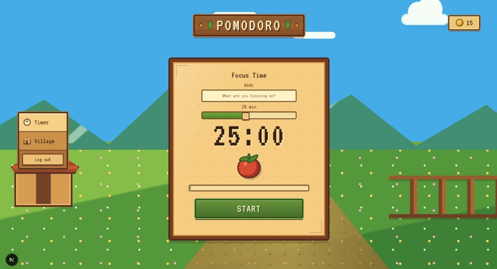
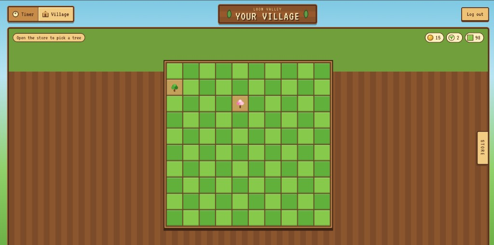
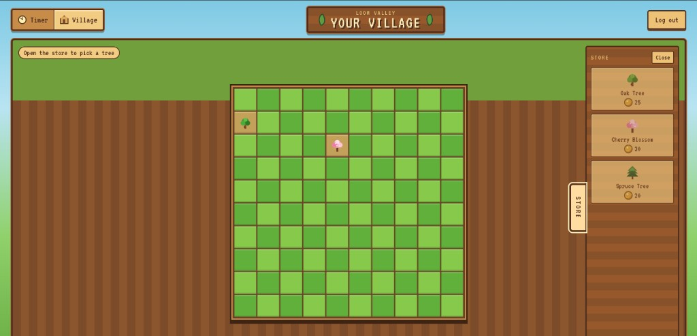

# Loom

Grow your world, one focused moment at a time.

Loom is a cozy pomodoro app. Finish a focus session, earn coins, and plant trees in Loom Valley.

<p align="center">
  
</p>

## Features

- **Focus timer** — pick a duration, optionally write a goal, and start a session
- **Harvest coins** — completed sessions pay out based on how long you focused
- **Loom Valley** — spend coins in the store and plant trees on a 10×10 village grid
- **Accounts** — register, log in, and keep your village and coin balance

<p align="center">
  
</p>

<p align="center">
  
</p>

## Stack

| Layer | Tech |
| --- | --- |
| App | Next.js 16, React 19 |
| API | Rust, Axum, SQLx |
| Database | PostgreSQL |

The browser never sees the backend JWT. Next.js keeps it in an HttpOnly cookie and forwards API calls from the server.

## Run locally

You need Docker, Rust, [sqlx-cli](https://github.com/launchbadge/sqlx/tree/main/sqlx-cli), and Node.js.

### 1. Database

From `backend/`:

```sh
docker compose up -d
cp .env.example .env
```

Add these to `backend/.env` as well (they are required to start the API):

```
JWT_SECRET=change-me
JWT_EXPIRED_IN=60m
JWT_MAXAGE=60
```

Apply migrations:

```sh
sqlx migrate run
```

### 2. API

```sh
cargo run
```

The API listens on [http://localhost:3000](http://localhost:3000).

### 3. App

From `frontend/`:

```sh
npm install
npm run dev
```

Open [http://localhost:3001](http://localhost:3001).

To point Next.js at a different API URL, set `BACKEND_API_URL` in `frontend/.env.local`. Do not prefix it with `NEXT_PUBLIC_`.

## How it works

1. Choose a focus length (5 seconds, or 5–60 minutes) and an optional goal.
2. Start the timer. The session is saved on the server.
3. If you finish the full duration, coins are added to your balance.
4. In **Village**, open the store, pick a tree, and plant it on an empty plot.

Coin rewards scale with session length, from 5 coins for a short focus up to 60 for an hour.

## Project layout

```
backend/     Rust API, migrations, and Docker Compose for Postgres
frontend/    Next.js app (timer, village, auth)
docs/        Screenshots used in this README
```

More setup notes live in [backend/README.md](backend/README.md) and [frontend/README.md](frontend/README.md).
